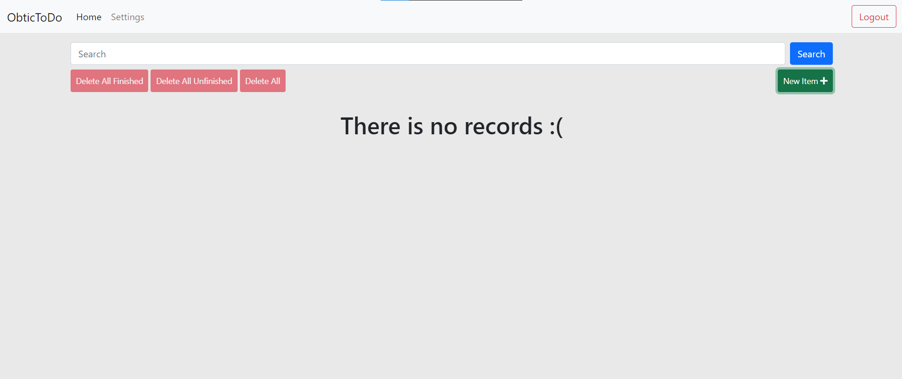

# ObticTodo - Django & Nginx & Waitress

------

This project can be deployed using Nginx and the Nginx config file is in the /nginx_conf directory and also the waitress server is already in the project root directory.

The front-end was created using Bootstrap 5 and some custom CSS.

1. #### configure your virtual environment 

   1. run ``` python -m venv env ``` to create the virtual environment 
   2. run ``` pip install -r requirements.txt ``` to install all the modules in the project (DO NOT FOREGT TO ACTIVATE YOUR venv )

2. #### configure your project

   1. run ``` python manage.py migrate ``` to create your db.sqlite3 file
   2. run ``` python manage.py collectstatic ``` to collect static files if you are going to use static_cdn if not skip it 

## Project overview 




